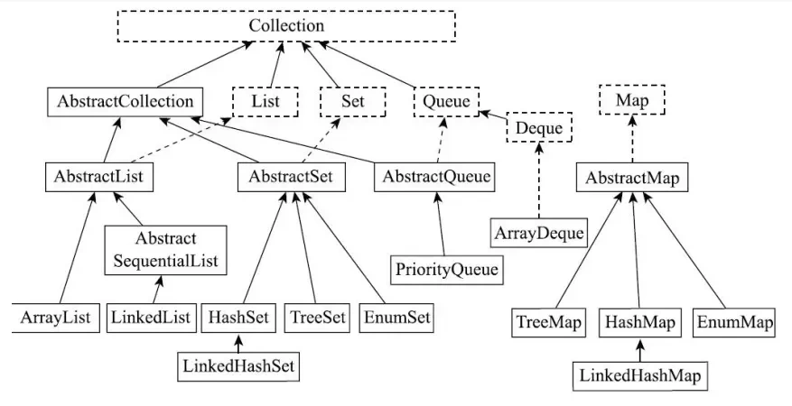

## 数组与集合的区别？

数组和集合的区别：

- 数组是固定长度的数据结构，一旦创建就无法改变；而集合是动态长度的数据结构，可以更具需求动态增加或减少元素。
- 数组可以包含基本数据类型和对象，而集合只能包含对象。
- 数组可以直接访问元素，而集合需要使用迭代器或其他方法才能访问元素。

## 常用集合有哪些？

1. ArrayList：动态数组，实现了 List 接口，支持动态增长。
2. LinkedList：双向链表，也实现了 List 接口，支持快速插入和删除。
3. HashMap：基于哈希表的 Map 实现，存储键值对，通过键快速获取值。
4. HashSet：基于哈希表的 Set 实现，存储唯一元素，通过元素快速判断是否包含。
5. TreeMap：基于红黑树实现的有序 Map 实现，存储键值对，通过键排序。
6. LinkedHashMap：基于哈希表表和双向链表的 Map 实现，保持插入顺序或访问顺序。
7. PriorityQueue：优先级队列，可以按照比较器或元素的自然顺序排序。

## Java 中的集合体系？



List 是有序的 Collection，使用此接口能够精确地控制每个元素的插入位置，用户能够根据索引访问 List 中的元素.常用的 List 实现类有 ArrayList、LinkedList、Vector、Stack。

- ArrayList：是动态数组，线程不安全，允许重复元素，允许 null 元素，查询效率较高，增删效率较低。
- LinkedList：是双向链表，线程不安全，允许重复元素，允许 null 元素，查询效率较低，增删效率较高。
- Vector：是动态数组，线程安全，不允许重复元素，不允许 null 元素，查询效率较高，增删效率较低。
- Stack：是 Vector 的子类，线程安全，不允许重复元素，不允许 null 元素，查询效率较低，增删效率较高。

Set 不允许存在重复元素，与 List 不同，Set 集合中的元素是无序的，不能通过索引访问元素。常用的 Set 实现类有 HashSet、LinkedHashSet、TreeSet。

- HashSet：通过 HashMap 实现，线程不安全，不允许重复元素，允许 null 元素，查询效率较高，增删效率较低。
- LinkedHashSet：通过 LinkedHashMap 实现，线程不安全，不允许重复元素，允许 null 元素，查询效率较低，增删效率较高。使用双向列表保存元素的插入顺序。
- TreeSet：通过 TreeMap 实现，线程不安全，不允许重复元素，不允许 null 元素，查询效率较低，增删效率较高。使用红黑树保存元素的排序顺序。

Map 是一个键值对集合，存储键值对。Key 无序唯一，Value 无序，允许重复。Map 没有继承于 Collection 接口，不能使用 foreach 循环遍历。从 map 中获取元素时，需要使用 Key 进行索引。常用的 Map 实现类有 HashMap、LinkedHashMap、TreeMap、Hashtable、Properties。

- HashMap：由数组+列表实现，数组的主体是 HashMap 的主体，列表主要是解决哈希冲突。JDK1.8 以后，数组+链表+红黑树，当链表长度超过 8 时，将链表转换为红黑树，以提升查询效率。
- LinkedHashMap：LinkedHashMap 继承于 HashMap，继承了 HashMap 的所有功能，并且还维护了一条双向链表，用于记录元素的插入顺序。
- HashTable：数组+链表实现，线程安全，不允许 null 键和 null 值，查询效率较低，增删效率较低。
- TreeMap：红黑树实现，线程不安全，不允许 null 键和 null 值，查询效率较高，增删效率较低。
- Properties: Node 数组+链表+红黑树实现，线程安全，允许 null 键和 null 值，查询效率较高，增删效率较低。

## Java 中线程安全的集合是什么？

在 java.util 包中，线程安全的类主要有 2 个，其他都是非线程安全的。

- Vector：线程安全的动态数组，其内部方法都是经过 synchronized 修饰的，如果不需要线程安全，并不建议选择，毕竟同步块会影响性能。Vector 内部是使用数组来保存数据，可以更具需求动态增加或减少元素。当数组容量不够时，会创建一个新的数组，将原数组中的元素复制到新数组中，并释放原数组。
- HashTable：线程安全的哈希表，HasTable 的加锁方法是给每个方法加上 synchronized 关键字，这样锁住的是整个 Table 对象,不支持迭代器，不支持 null 键和 null 值。由于 HashTable 的效率较低，不建议使用。如果要保证线程安全，建议使用 ConcurrentHashMap。

java.util.concurrent 包中提供了线程安全的集合类，如 ConcurrentHashMap、ConcurrentLinkedQueue、ConcurrentSkipListMap、ConcurrentSkipListSet 等。这些集合类都继承于 AbstractCollection 类，实现了 Collection 接口。这些集合类都提供了线程安全的方法，如 putIfAbsent()、replace()、remove()、contains()等。这些方法都使用了锁机制，保证线程安全。

## Collections 和 Collection 的区别？

- Collections：是 java.util 包下的一个类，提供了一系列静态方法，用于操作集合对象。Collections 类提供了一系列静态方法，用于对集合对象进行操作，如排序、查找、修改、删除等。这些方法对可以实现了 Collection 接口的类进行操作。
- Collection：是 java.util 包下的一个接口，定义了集合类的基本操作。Collection 接口定义了集合类的基本操作，如添加、删除、修改、查找、遍历等。Collection 接口的实现类有 ArrayList、LinkedList、HashSet、TreeSet、HashMap、TreeMap 等。

## 集合的遍历方式有哪些？

- **普通 forr 循环**：可以使用带有索引的 for 循环来遍历 List。

```
List<String> list = new ArrayList<>();
list.add("a");
list.add("b");
list.add("c");

for (int i = 0; i < list.size(); i++) {
  System.out.println(list.get(i));
}
```

- **增强 for 循环**：可以使用增强 for 循环来遍历 List。

```
List<String> list = new ArrayList<>();
list.add("a");
list.add("b");
list.add("c");

for (String s : list) {
  System.out.println(s);
}
```

- **Iterator 迭代器**：可以使用迭代器来遍历 List,特别适合用于需要删除集合中的元素。

```
List<String> list = new ArrayList<>();
list.add("a");
list.add("b");
list.add("c");

Iterator<String> iterator = list.iterator();

while (iterator.hasNext()) {
  String s = iterator.next();
  System.out.println(s);
}
```

- **ListIterator**：ListIterator 是 Iterator 的子接口，提供了额外的方法，如 hasPrevious()、previous()、nextIndex()、previousIndex()等。可以修改集合中的元素。

```
List<String> list = new ArrayList<>();
list.add("a");
list.add("b");
list.add("c");

ListIterator<String> iterator = list.listIterator();

while (iterator.hasNext()) {
  String s = iterator.next();
  System.out.println(s);
}
```

- **forEach()方法**：可以使用 forEach()方法来遍历 List。

```
List<String> list = new ArrayList<>();
list.add("a");
list.add("b");
list.add("c");

list.forEach(System.out::println);
```

- **Stream API**：可以使用 Stream API 来遍历 List。Stream API 提供了丰富的方法，如 filter()、map()、sorted()、limit()、skip()、flatMap()、distinct()、peek()、count()、max()、min()、anyMatch()、allMatch()、noneMatch()、findFirst()、findAny()、toArray()、collect()、reduce()等。

```
List<String> list = new ArrayList<>();
list.add("a");
list.add("b");
list.add("c");

list.stream().forEach(System.out::println);
```

## 常见的常见的 List 集合

### 非线程安全

- ArrayList：线程不安全，非线程安全，ArrayList 的实现原理是数组，数组的长度是固定的，当数组的长度不够时，会创建一个新的数组，将原数组中的元素复制到新数组中，并释放原数组。
- LinkedList：线程不安全，非线程安全，LinkedList 的实现原理是链表，链表的长度是动态的，当链表的长度不够时，会创建一个新的链表，将原链表的元素复制到新链表中，并释放原链表。

### 线程安全

- Vector：线程安全，Vector 的实现原理是数组，数组的长度是固定的，当数组的长度不够时，会创建一个新的数组，将原数组中的元素复制到新数组中，并释放原数组。
- CopyOnWriteArrayList：在对数据进行修改的时候，会创建一个新的数组，将修改应用到新的数组中，而读操作仍然在原数组中执行，从而实现线程安全。而且实现了读写分离，提高了并发性能。适用于。

## 讲一下 Java 里面 List 集合的几种实现，几种实现的区别？

在 Java 中 List 集合的几种实现，几种实现的区别如下：


- Vector 是 Java 早期提供的线程安全的动态数组，如果不需要线程安全，并不建议选择，毕竟同步块会影响性能。Vector 内部是使用数组来保存数据，可以更具需求动态增加或减少元素。当数组容量不够时，会创建一个新的数组，将原数组中的元素复制到新数组中，并释放原数组。
- ArrayList 是应用更加广泛的动态数组，内部使用数组来保存数据，可以更具需求动态增加或减少元素。当数组容量不够时，会创建一个新的数组，将原数组中的元素复制到新数组中，并释放原数组。不过和 Vector 不一样的是，Vector 的扩容会提高 2 倍，ArrayList 的扩容是 1.5 倍。
- LinkedList 是 Java 集合中的一个链表实现，内部使用链表来保存数据，可以更具需求动态增加或减少元素。LinkedList 的实现原理是链表，链表长度是动态的，所以它不需要向 Vector 和 ArrayList 进行扩容,当链表长度不够时，会创建一个新的链表，将原链表的元素复制到新链表中，并释放原链表。

## List 可以一边遍历一边修改元素吗？

在 Java 中，List 在遍历过程中是否可以修改元素，这取决于遍历的方式和具体的 List 实现类，以下是几种常见的情况：

- **使用普通 for 循环遍历**：可以在遍历过程中修改元素，只要索引不超出 List 的范围即可。
- **for-each 循环遍历**：一般不建议在 foreach 循环中修改正在遍历的元素，因为这可能会造成意外的结果或==ConcurrentModificationException==异常。在==for-each==循环中修改元素可能会破坏迭代器的内部状态，因为==for-each==是基于迭代器实现的，在遍历过程中修改集合结构，会导致迭代器的预期结构和实际结构不一致。
- **使用迭代器遍历**：可以在迭代器遍历过程中修改元素（使用迭代器提供的 ==set()== 方法,如果使用 List 提供的 ==set()== 方法, ==ConcurrentModificationException== 异常），但是不能在迭代器遍历过程中删除元素。

## List 如何快速的删除某个指定下标的元素？

- ArrayList 提供了 remove(int index)方法，该方法可以删除指定索引的元素。该方法在删除元素后，会将后续元素向前移动，以填补删除元素的位置。如果删除的是末尾元素，时间复杂度为 O(1)，否则时间复杂度为 O(n)。
- LinkedList 提供了 remove(Object o)方法，该方法可以删除指定元素。它需要先遍历指定下标位置，然后修改链表的指针来删除元素。时间复杂度为 O(n)。不过如果要删除的元素是头节点或末节点，时间复杂度为 O(1)。

## ArrayList 和 LinkedList 的区别？

- **底层数据解构不同：** ArrayList 底层数据结构是数组，通过索引进行快速访问元素。LinkedList 底层数据结构是链表，通过节点之间的指针进行访问和操作元素。
- **插入和删除效率不同：** ArrayList 的插入和删除效率较低，因为需要移动元素。LinkedList 的插入和删除效率较高，因为只需要修改指针。
- **随机访问效率不同：** ArrayList 的随机访问效率较高，因为可以通过索引快速访问元素，时间复杂度 O(1)。LinkedList 的随机访问效率较低，因为需要遍历链表,时间复杂度 O(n)。
- **内存占用不同：** ArrayList 的内存占用较高，因为数据在创建的时候需要分配一段连续的存储空间。LinkedList 的内存占用较低，因为每个节点只需要存储元素和指针。
- **使用场景不同：** ArrayList 更适合随机访问和插入删除元素，而 LinkedList 更适合频繁的插入和删除元素。

## ArrayList 线程安全吗？把 ArrayList 变成线程安全有哪些方法？
ArrayList 线程不安全，把 ArrayList 变成线程安全的方法有：
- 使用 ==Collections.synchronizedList( )== 方法，将ArrayList 转换成线程安全的 List。
```
List<String> list = Collections.synchronizedList(new ArrayList<>());
```
- 使用 ==CopyOnWriteArrayList== 类代替ArrayList，它是线程安全的。
```
CopyOnWriteArrayList<String> list = new CopyOnWriteArrayList<>(arrayList);
```
- 使用 ==Vector== 类代替ArrayList，它是线程安全的。
```
Vector<String> list = new Vector<>(arrayList);
```

## 为什么ArrayList 线程不安全,具体来说是哪里线程不安全？
在高并发添加数据下，ArrayList会暴露三个线程不安全问题：
- **部分值为null：** ArrayList的add方法在添加数据时，如果数组已满，则创建一个新的数组，将原数组中的元素复制到新数组中，并释放原数组。但是，如果创建新数组的过程中，其他线程正在访问数组，可能会导致部分值为null。
- **索引越界异常：** ArrayList的add方法在添加数据时，如果数组已满，则创建一个新的数组，将原数组中的元素复制到新数组中，并释放原数组。但是，如果创建新数组的过程中，其他线程正在访问数组，可能会导致索引越界异常。
- **size()与我们add()的数量不符：** ArrayList的size()方法返回的是当前数组的长度，而不是当前数组中实际存储的元素数量。如果其他线程正在访问数组，可能会导致size()方法返回的数组长度与实际存储的元素数量不符。

## ArrayList和LinkedList的应用场景？
- ArrayList适合需要频繁均访问的场景。它基于数组实现，可以快速访问元素，因此在索引查找、遍历和随机访问元素时性能较高。
- LinkedList适合需要频繁插入和删除的场景。它基于链表实现，插入和删除元素时性能较高，因为只需要修改指针。

## ArrayList的扩容机制？
ArrayList在添加元素时，如果当前元素已经达到内部数组的容量上限，就会触发扩容操作。ArraryList的扩容操作主要包括以下几个步骤：
- **计算新的容量：** 一般情况下，新的容量会扩大为原容量的1.5倍，然后检查是否超过最大容量限制。
- **创建新的数组：** 根据新的容量创建一个新的数组。
- **复制元素：** 将原数组中的元素复制到新的数组中。
- **更新数组引用：** 将新的数组引用赋给ArrayList对象。

## 线程安全的List,CopyOnWriteArrayList是如何实现线程安全的？
CopyOnWriteArrayList 底层也是通过一个数组保存数据，使用volatile关键字修饰数组，保证当前线程对数组对象重新赋值后，其他线程可以及时感知到。
```
private volatile Object[] array;
```
在写入操作时，加了一把互斥锁ReentrantLock，保证写入操作的原子性。
```
public void add(E e) {
  // 获取锁
  final ReentrantLock lock = this.lock;
  // 加锁
  lock.lock();
  try {
    // 获取数组
    Object[] elements = getArray();
    // 获取数组长度
    int len = elements.length;
    // 创建新的数组
    Object[] newElements = new Object[len + 1];
    // 复制数组
    System.arraycopy(elements, 0, newElements, 0, len);
    // 更新数组引用
    newElements[len] = e;
    // 更新数组引用
    setArray(newElements);
   }
  finally { 
    lock.unlock();
  }
}
```
但是读操作不需要加锁，因为数组对象是volatile修饰的，其他线程可以及时感知到数组对象的变化。

